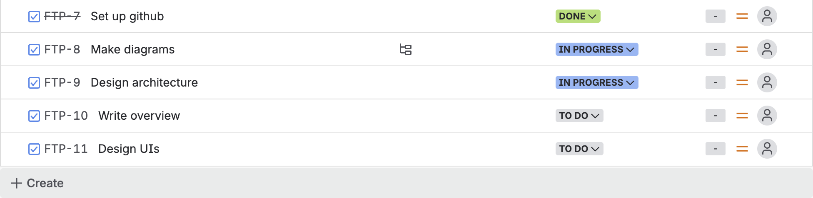
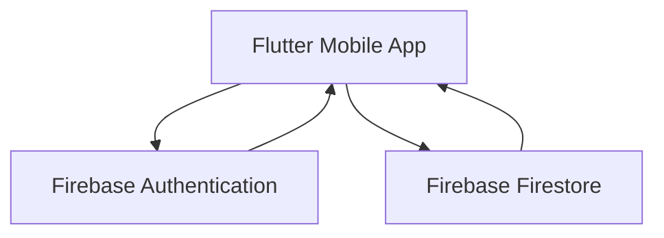
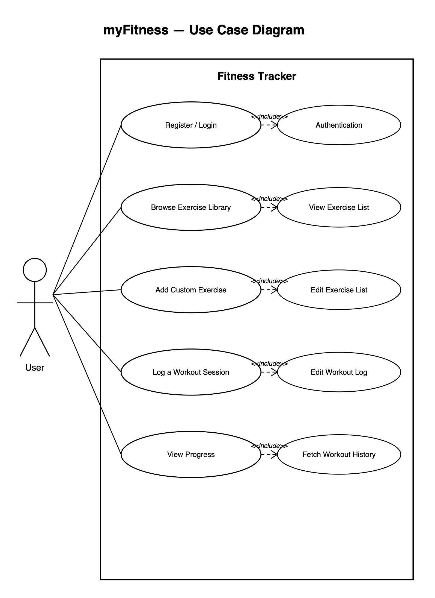
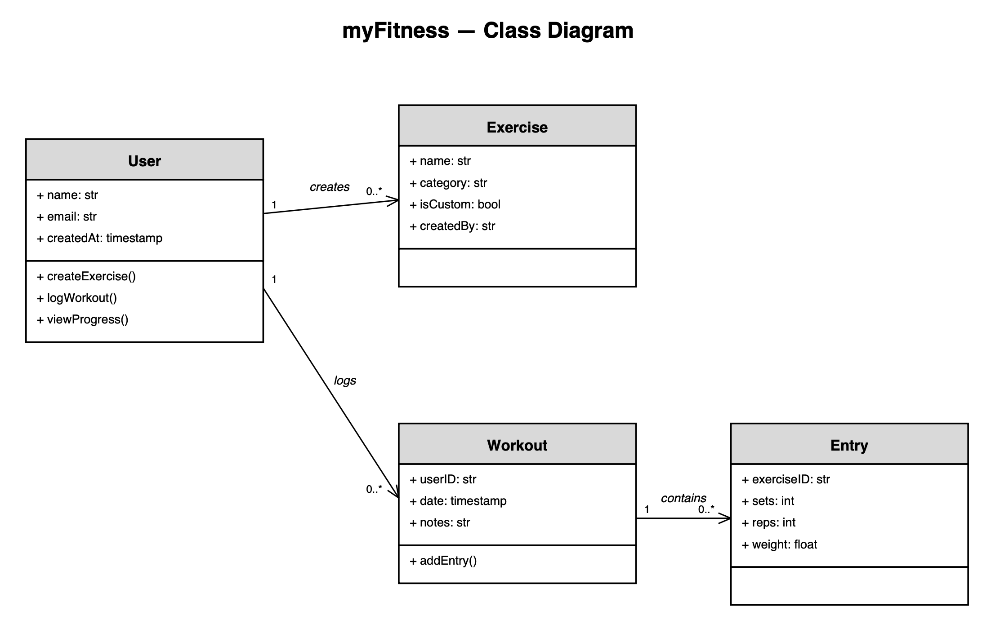
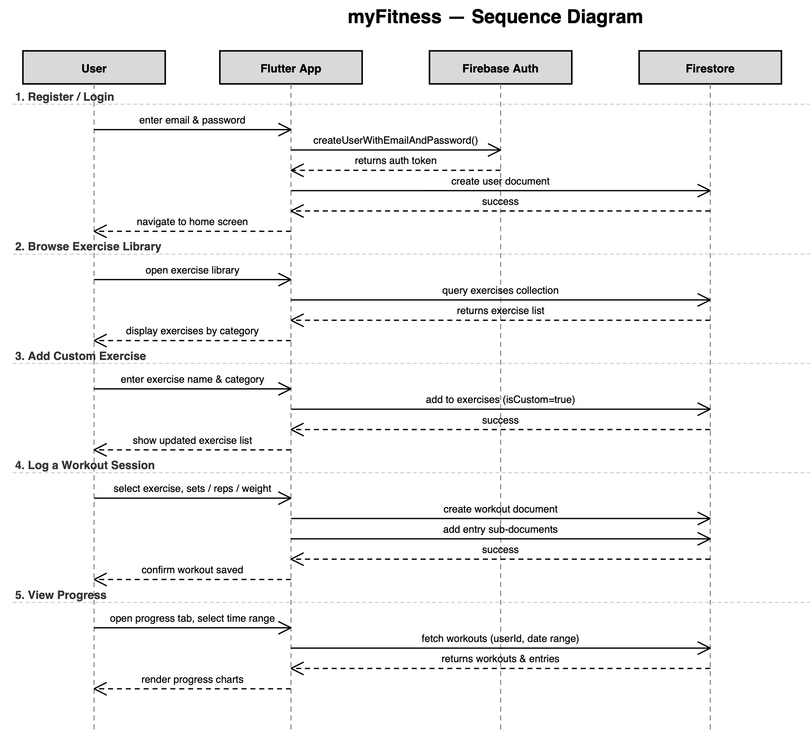
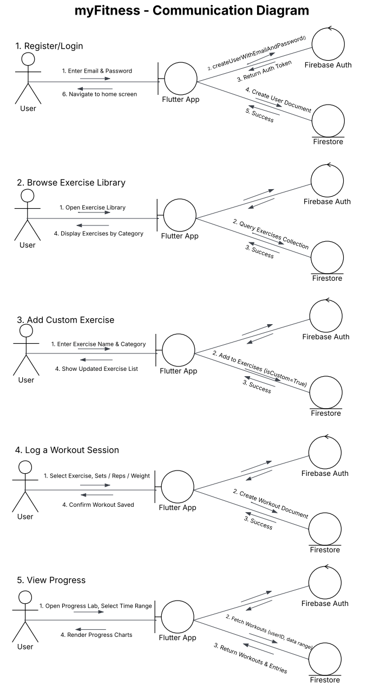
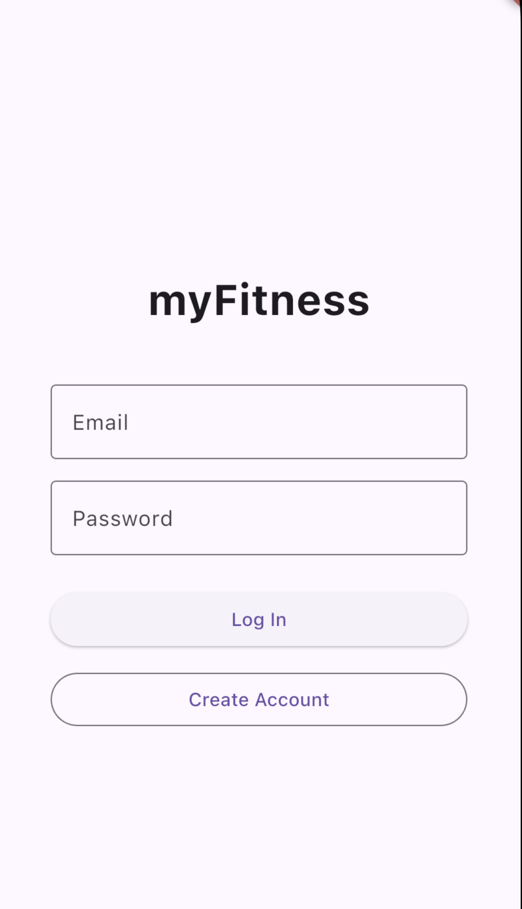
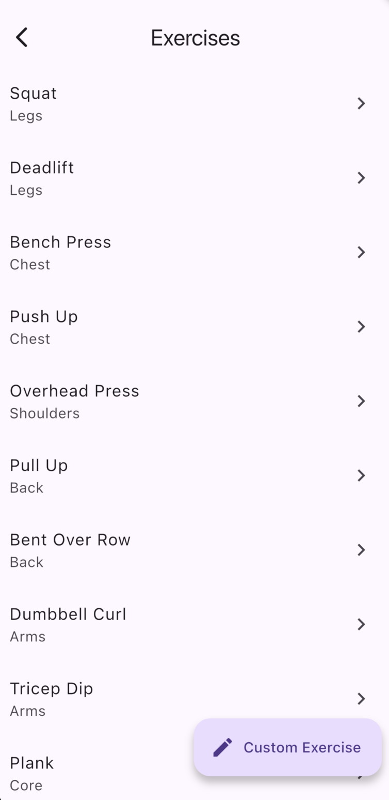
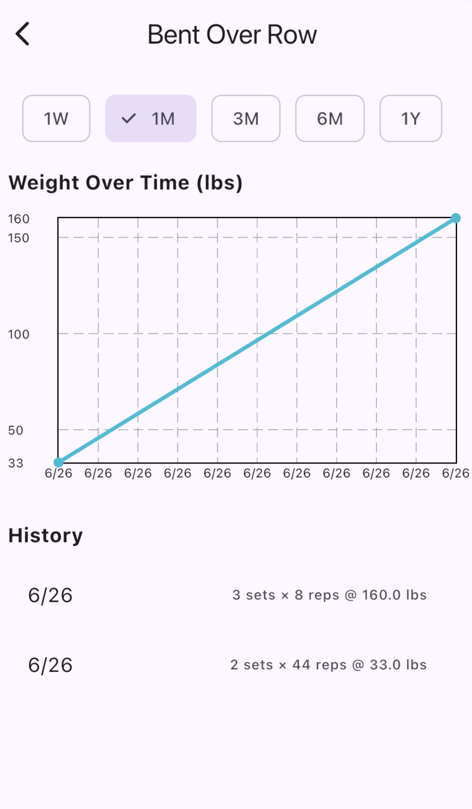

# myFitness

## Abstract

Being active is a crucial part of one's health. Whether chasing new personal records or simply staying physically and mentally fit, it's easy to get caught up in daily life and lose track of our progress. myFitness solves this by placing your personal fitness journey in your pocket.

---
## Introduction

myFitness is a fitness tracking application developed for CIS 350 (Introduction to Software Engineering). The app allows users to log and monitor their workouts over time. Users can select from a built-in library of exercises (e.g., squats, dumbbell curls) or define their own custom exercises (e.g., jumping jacks). For each workout session, users log the date, sets × reps performed, and weight used. A progress tab visualizes improvements over a selected time period — including metrics such as progressive overload (weight increases) and volume trends (sets/reps over time).

---

## Table of Contents

- [Team Members](#team-members)
- [Project Management](#project-management)
- [Features](#features)
- [Architectural Design](#architectural-design)
- [Use Case Diagram](#use-case-diagram)
- [Class Diagram](#class-diagram)
- [Sequence Diagram](#sequence-diagram)
- [Communication Diagram](#communication-diagram)
- [Tech Stack](#tech-stack)
- [User Interface (UI)](#user-interface-ui)
- [Setup & Installation](#setup--installation)

---

## Team Members

| Name |
|------|
| CK Thang  |
|Leah Linton|

---

## Project Management

Jira Board:

We use Jira to manage tasks, track progress, and organize our work into sprints. Each sprint contains a set of tickets representing individual tasks or features. As work begins on a ticket it is moved to **In Progress**, and marked **Done** upon completion. This gives us a clear picture of what's been accomplished and what still needs to be done at any point in the project.

**Project Checkpoint 1 Sprint (Jun 3 – Jun 5):**



---

## Features

- **User Registration & Login** — Create an account with name, email, and password. Existing users sign in with email and password. Session is managed by Firebase Authentication.
- **Exercise Library** — Browse a built-in library of exercises organized by muscle group (Legs, Chest, Back, Shoulders, Arms, Core)
- **Custom Exercises** — Add your own exercises with a name and category during a workout session
- **Workout Logging** — Start a workout session, select exercises, and log sets, reps, and weight for each
- **Workout History** — View all previous workout sessions on the home screen, tap to edit or delete any entry
- **Progress Tracking** — View a per-exercise weight chart over selectable time periods (1 week, 1 month, 3 months, 6 months, 1 year) with a history list below

---

## Architectural Design

myFitness follows a client-serverless architecture. The Flutter mobile app communicates directly with Firebase services — there is no custom backend server.

- **Frontend:** Flutter (Dart) — cross-platform mobile app for iOS and Android
- **Auth:** Firebase Authentication — handles user registration, login, and session management
- **Database:** Firebase Firestore — NoSQL cloud database storing users, exercises, and workout logs
- **Hosting/Backend:** Firebase — no separate server required

### System Architecture Diagram



| Arrow | Description |
|-------|-------------|
| App → Firebase Authentication | Login / Register requests |
| Firebase Authentication → App | Returns auth token |
| App → Firebase Firestore | Read/Write workouts and exercises |
| Firebase Firestore → App | Returns user data, workouts, exercises |

### Firestore Data Structure

Firestore organizes data into **collections** (like tables) containing **documents** (like rows). Below is the data model for myFitness:

```
users/
  {userId}/
    name: string
    email: string
    createdAt: timestamp

exercises/
  {exerciseId}/
    name: string
    category: string       // e.g. "legs", "chest", "arms"
    isCustom: boolean
    createdBy: string      // userId if custom, null if built-in

workouts/
  {workoutId}/
    userId: string
    date: timestamp
    notes: string
    entries/               // subcollection — one per exercise in this session
      {entryId}/
        exerciseId: string
        sets: number
        reps: number
        weight: number     // in lbs or kg
```

---

## Use Case Diagram

Primary actor: **User**

Key use cases:
- Register / Login
- Browse exercise library
- Add custom exercise
- Log a workout session
- View progress over time



---

## Class Diagram

The class diagram below outlines the core entities of myFitness, their attributes, methods, and relationships. A User can create custom exercises and log multiple workout sessions. Each workout session contains one or more entries, where each entry records the exercise performed along with sets, reps, and weight.



---

## Sequence Diagram

The sequence diagram illustrates the interaction between the User, Flutter App, Firebase Authentication, and Firestore across all five key use cases. It shows the order of messages exchanged — solid arrows represent requests or actions, while dashed arrows represent responses returned from a service.



---

## Communication Diagram 

The communication diagram illustrates how the key objects in myFitness — the User, Flutter App, Firebase Authentication, and Firestore — interact with each other across all five use cases. Unlike the sequence diagram which focuses on the time order, the communication diagram emphasizes the relationships and numbered message flow between objects. Each scenario shows how the Flutter App acts as the central hub, coordinating between the user's actions and the Firebase backend services. 



---

## Tech Stack

| Layer      | Technology              |
|------------|-------------------------|
| Frontend   | Flutter (Dart)          |
| Backend    | Firebase (serverless)   |
| Database   | Firebase Firestore      |
| Auth       | Firebase Authentication |

---

## User Interface (UI)
### Login / Register Screen
This screen shows the login/registration page for the user. 



### Exercise List
This screen shows the list of exercises user can select. 



### Progress View
This screen shows the progress the user has made over a given period of time. 



---

## Setup & Installation

### Prerequisites
- [Flutter SDK](https://docs.flutter.dev/get-started/install) installed
- [Xcode](https://developer.apple.com/xcode/) (for iOS) or Android Studio (for Android)
- A Firebase project with Authentication and Firestore enabled

### Steps

```bash
# Clone the repository
git clone https://github.com/CKThang/fitness-tracker.git
cd fitness-tracker/myfitness

# Install dependencies
flutter pub get

# Run the app on a connected device or simulator
flutter run
```

### Firebase Setup
1. Create a Firebase project at [console.firebase.google.com](https://console.firebase.google.com)
2. Enable **Email/Password** under Authentication → Sign-in method
3. Create a **Firestore** database in test mode
4. Run `dart pub global run flutterfire_cli:flutterfire configure` to generate `firebase_options.dart`

---

*CIS 350 — Introduction to Software Engineering*
